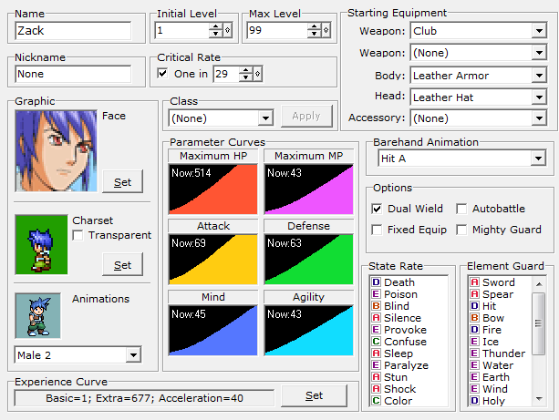
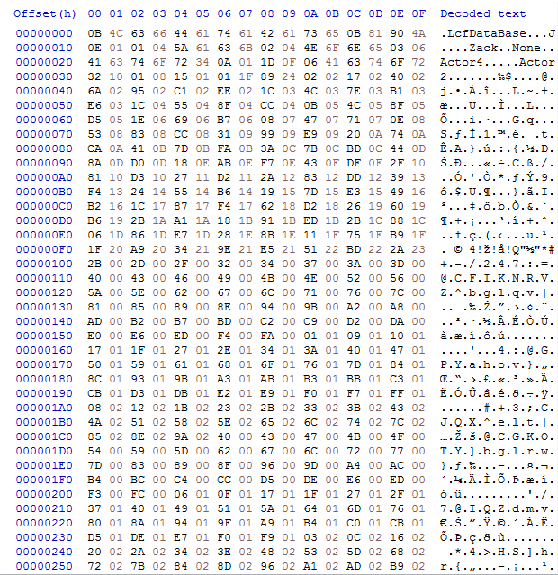
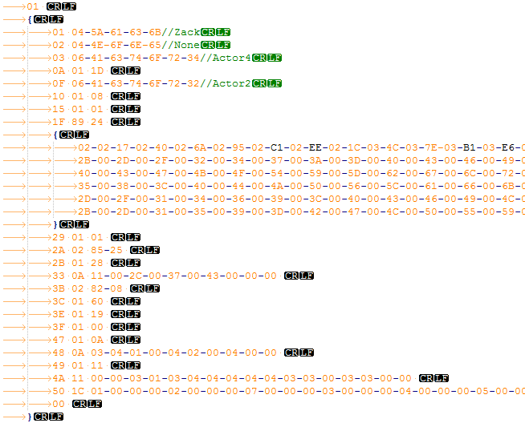

# RPG Maker LDB Printer
&#160;
&#160;

&#160;
&#160;

&#160;
&#160;

&#160;
&#160;

Print hex Data from a Lcf Data Base into a text file, seperated into indented lines.
More readable than a hex editor.

Just drag the LDB file you want to print onto the RPG Maker LDB Printer exe, and it will output a readable text file of the same name.
Open it with a text editor that can close braces, like Notepad++, and set the language to somthing that uses them, like Javascript, C++, or C#.

